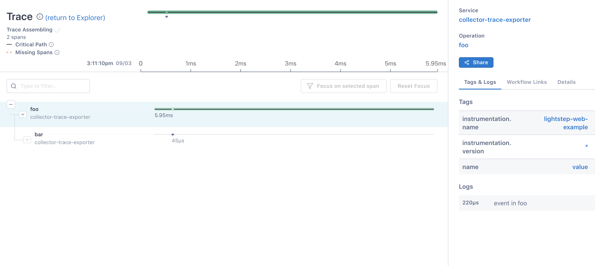
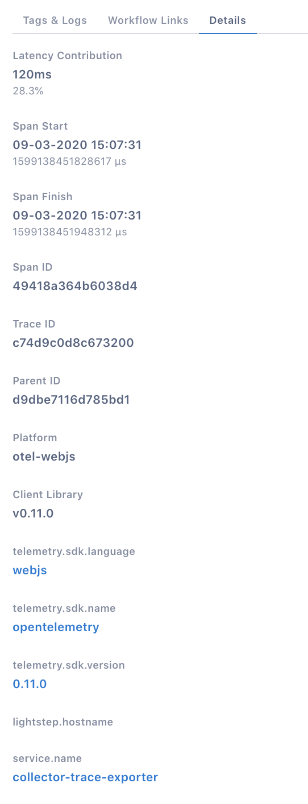
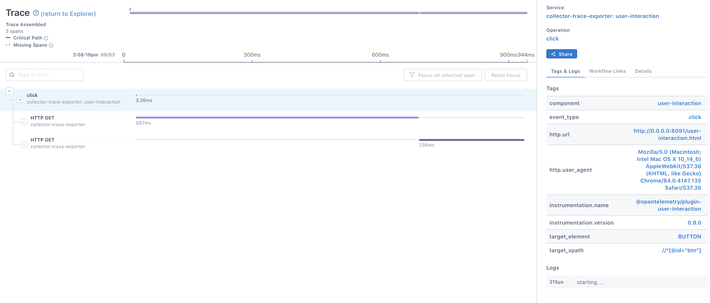

This Quick Start shows you how to use [OpenTelemetry](https://opentelemetry.io) in your browser to:

- Configure a tracer
- Generate trace data
- Propagate context over HTTP
- Export the trace data to the console and to the Lightstep
- Enable auto instrumentation for document load
- Enable auto instrumentation for button any XMLHttpRequest

The full code for the example in this guide can be found [here](https://github.com/lightstep/opentelemetry-examples/tree/master/browser).

## Requirements

Modern Browser with latest version

## Setup

To use OpenTelemetry, you need to install the API, SDK, span processor and exporter packages. The version of the SDK and API used in this guide is **0.5.1**, the most current version as of writing.

```shell script
    mkdir lightstep-web-example
    cd lightstep-web-example
    npm init
    npm install @opentelemetry/api @opentelemetry/web @opentelemetry/tracing --save 
```

## Collect Trace Data

You need to configure a [TraceProvider](/docs/tracing-in-opentelemetry) to collect tracing information. A tracer is an object that tracks the currently active span and allows you to create (or activate) new spans. As spans are created and completed, the tracer dispatches them to an [exporter](https://docs.lightstep.com/otel/exporters-in-opentelemetry) that can send the spans to a backend system for analysis.

In this first example, the TraceProvider is configured using `ConsoleSpanExporter`, which prints tracing information to the console.

1. Import OpenTelemetry and create a tracer configured to send data to the console, saving it as `tracer.js`.

```javascript
    'use strict';

    // this will be needed to get tracer
    import opentelemetry from '@opentelemetry/api';
    // we need tracer
    import { WebTracerProvider } from '@opentelemetry/web';
    // and exporter with span processor
    import { ConsoleSpanExporter, SimpleSpanProcessor } from '@opentelemetry/tracing';
    
    // Create a provider for activating and tracking spans
    const tracerProvider = new WebTracerProvider();
    
    // Configure a span processor and exporter for the tracer
    tracerProvider.addSpanProcessor(new SimpleSpanProcessor(new ConsoleSpanExporter()));
    
    // Register the tracer
    tracerProvider.register();
```

2. Create a new file `index.html`

```html
    <!DOCTYPE html>
    <html lang="en">
    
    <head>
        <meta charset="utf-8">
        <title>Lightstep Web Example</title>
        <base href="/">
        <meta name="viewport" content="width=device-width, initial-scale=1">
        <script type="text/javascript" src="tracer.js"></script>
    </head>
    
    <body>
        <h3>Tracer example</h3>
        Please open the web developer tool to see the console
    </body>
    
    </html>
```

3. Now add some example span to previously created file `tracer.js`

```javascript
    const tracer = opentelemetry.trace.getTracer('lightstep-web-example');
    
    const span = tracer.startSpan('my first span');
    span.setAttribute('my first attribute', 'otel is great!');
    span.addEvent('something has happened, save it');
    span.end();

```

4. Let's see how this will look like in browser. You need some server to run the page and bundle the all code together
For that we will use webpack and babel
```bash
    npm install @babel/core babel-loader webpack webpack-cli webpack-dev-server --save-dev
     
```
5. Create now a file called `webpack.config.js` and copy paste the minimum configuration

```javascript
    module.exports = {
      mode: 'development',
      entry: {
        'tracer': 'tracer.js',
      },
      output: {
        filename: '[name].js',
        sourceMapFilename: '[file].map',
      },
      target: 'web',
      module: { rules: [{ test: /\.js$/, exclude: /(node_modules)/, use: { loader: 'babel-loader' } }] },
      resolve: { modules: [__dirname, 'node_modules'], extensions: ['.js'] },
      devtool: 'eval-source-map',
    };
```
6. Edit package.json with your favourite Editor and add start script into "scripts" section 
```json
{
  "scripts": {
    "start": "webpack-dev-server -d --progress --colors --port 8091 --config webpack.config.js --hot --inline --host 0.0.0.0"
  }
}

``` 
7. Finally lets see how everything looks like
```shell script
    npm start
```
8. Open browser at address 'http://localhost:8091/', You should see something similar in console
```json
    {
      "traceId": "985b66d592a1299f7d12ebca56ca1fe3",
      "name": "my first span",
      "id": "8d62a70aa335a227",
      "kind": 0,
      "timestamp": 1585130342183948,
      "duration": 315,
      "attributes": { "my first attribute": "otel is great!" },
      "status": { "code": 0 },
      "events": [{ "name": "something has happened, save it", "time": [1585130342, 184213041] }]
    }
```
Congratulation you have successfully created your first working example

## Configure the Lightstep Exporter
We assume that you have completed the "Collect Trace Data", In this example we will replace the Console Exporter with Lightstep Exporter

1.  Install Lightstep Exporter 
```shell script
    npm install lightstep-opentelemetry-exporter --save 
```

2. Edit `tracer.js` and add below code
```javascript
    // ...

    import { LightstepExporter } from 'lightstep-opentelemetry-exporter';

    // ...

    tracerProvider.addSpanProcessor(new SimpleSpanProcessor(new LightstepExporter({
      token: 'YOUR_TOKEN'
    })));
``` 
3. If everything went correctly you should be able to see the traces in Lightstep



## Auto instrumentation for document load
1. Install needed packages
```shell script
    npm install @opentelemetry/plugin-document-load @opentelemetry/context-zone --save
```
1. For that we can create a new file `documentLoad.js`
```javascript
    'use strict';
    
    import { WebTracerProvider } from '@opentelemetry/web';
    import { ConsoleSpanExporter, SimpleSpanProcessor } from '@opentelemetry/tracing';
    import { LightstepExporter } from 'lightstep-opentelemetry-exporter';
    import { DocumentLoad } from '@opentelemetry/plugin-document-load';
    import { ZoneContextManager } from '@opentelemetry/context-zone';
    
    // Create a provider for activating and tracking spans
    const tracerProvider = new WebTracerProvider({
      plugins: [
        new DocumentLoad(),
      ],
    });
    
    // Configure a span processor and exporter for the tracer
    tracerProvider.addSpanProcessor(new SimpleSpanProcessor(new ConsoleSpanExporter()));
    tracerProvider.addSpanProcessor(new SimpleSpanProcessor(new LightstepExporter({
      token: 'YOUR_TOKEN'
    })));
    
    // Register the tracer
    tracerProvider.register({
      contextManager: new ZoneContextManager().enable(),
    });
```

2. Modify the webpack.config section entry

```javascript
    // ...
    entry: {
      'document-load': 'document-load.js'
    }
    // ...
```
3. Create a new file called `document-load.html`

```html
    <!DOCTYPE html>
    <html lang="en">
    
    <head>
        <meta charset="utf-8">
        <title>Lightstep Web Example - document load auto instrumentation</title>
        <base href="/">
        <meta name="viewport" content="width=device-width, initial-scale=1">
        <script type="text/javascript" src="document-load.js"></script>
    </head>
    <body>
        <h3>Document Load</h3>    
        Please open the web developer tool to see the console
    </body>
    
    </html>

``` 
4. Run script
```shell script
    npm start
```
5. Open browser at address 'http://localhost:8091/document-load.html', You should see something similar in Lightstep





## Auto instrumentation for User Interaction
1. Install needed packages
```shell script
    npm install @opentelemetry/plugin-user-interaction @opentelemetry/plugin-xml-http-request @opentelemetry/context-zone --save
```
1. For that we can create a new file `user-interaction.js`
```javascript
    'use strict';
    
    import opentelemetry from '@opentelemetry/api';
    import { WebTracerProvider } from '@opentelemetry/web';
    import { ConsoleSpanExporter, SimpleSpanProcessor } from '@opentelemetry/tracing';
    import { LightstepExporter } from 'lightstep-opentelemetry-exporter';
    import { ZoneContextManager } from '@opentelemetry/context-zone';
    import { UserInteractionPlugin } from '@opentelemetry/plugin-user-interaction';
    import { XMLHttpRequestPlugin } from '@opentelemetry/plugin-xml-http-request';
    
    // Create a provider for activating and tracking spans
    const tracerProvider = new WebTracerProvider({
      plugins: [
        new UserInteractionPlugin(),
        new XMLHttpRequestPlugin({
          // this is webpack  auto reload - we can ignore it
          ignoreUrls: [/localhost:8091\/sockjs-node/],
          propagateTraceHeaderCorsUrls: '*',
        }),
      ],
    });
    
    // Configure a span processor and exporter for the tracer
    tracerProvider.addSpanProcessor(new SimpleSpanProcessor(new ConsoleSpanExporter()));
    tracerProvider.addSpanProcessor(new SimpleSpanProcessor(new LightstepExporter({
      token: 'YOUR_TOKEN'
    })));
    
    // Register the tracer
    tracerProvider.register({
      contextManager: new ZoneContextManager().enable(),
    });
    
    function getData(url, resolve) {
      return new Promise(async (resolve, reject) => {
        const req = new XMLHttpRequest();
        req.open('GET', url, true);
        req.setRequestHeader('Content-Type', 'application/json');
        req.setRequestHeader('Accept', 'application/json');
        req.send();
        req.onload = function () {
          resolve();
        };
      });
    }
    const tracer = opentelemetry.trace.getTracer('lightstep-web-example');
    
    window.addEventListener('load', () => {
      const btnAdd = document.getElementById('btn');
      btnAdd.addEventListener('click', () => {
      tracer.getCurrentSpan().addEvent('starting ...');
      getData('https://httpbin.org/get?a=1').then(() => {
        tracer.getCurrentSpan().addEvent('first file downloaded');
        getData('https://httpbin.org/get?a=1').then(() => {
          tracer.getCurrentSpan().addEvent('second file downloaded');
        });
      });
      });
    });
```

2. Modify the webpack.config section entry

```javascript
    // ...
    entry: {
      'user-interaction': 'user-interaction.js',
    }
    // ...
```
3. Create a new file called `user-interaction.html`

```html
    <!DOCTYPE html>
    <html lang="en">
    
    <head>
        <meta charset="utf-8">
        <title>Lightstep Web Example - user interaction</title>
        <base href="/">
        <meta name="viewport" content="width=device-width, initial-scale=1">
        <script type="text/javascript" src="user-interaction.js"></script>
    </head>
    <body>
        <h3>User Interaction</h3>
        Please open the web developer tool and then click on below button
        <br/>
        <button id="btn">CLICK ME!</button>
    </body>
    
    </html>
``` 
4. Run script
```shell script
    npm start
```
5. Open browser at address 'http://localhost:8091/user-interaction.html', You should see something similar in Lightstep




