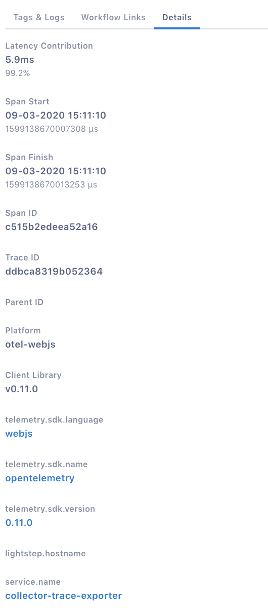
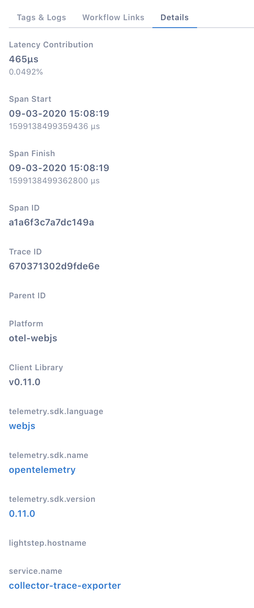

This Quick Start shows you how to use [OpenTelemetry](https://opentelemetry.io) in your browser to:

- Configure a tracer
- Generate trace data
- Propagate context over HTTP
- Export the trace data to the console and to the Lightstep
- Enable auto instrumentation for document load
- Enable auto instrumentation for button any XMLHttpRequest

The full code for the example in this guide can be found [here](https://github.com/lightstep/opentelemetry-examples/tree/master/browser).

## Requirements

An up to date modern browser

## Setup

To use OpenTelemetry, you need to install the API, SDK, span processor and exporter packages. The version of the SDK and API used in this guide is **0.5.1**, the most current version as of writing.

```shell script
    mkdir lightstep-web-example
    cd lightstep-web-example
    npm init
    npm install @opentelemetry/api @opentelemetry/web @opentelemetry/tracing --save
```

## Collect Trace Data

You need to configure a [TracerProvider](/docs/tracing-in-opentelemetry) to collect tracing information. A tracer is an object that tracks the currently active span and allows you to create (or activate) new spans. As spans are created and completed, the tracer dispatches them to an [exporter](https://docs.lightstep.com/otel/exporters-in-opentelemetry) that can send the spans to a backend system for analysis.

In this first example, the TracerProvider is configured using `ConsoleSpanExporter`, which prints tracing information to the console.

1. Import OpenTelemetry and create a tracer configured to send data to the console, saving it as `tracer.js`.

```javascript
'use strict';

// this will be needed to get a tracer
import opentelemetry from '@opentelemetry/api';
// tracer provider for web
import { WebTracerProvider } from '@opentelemetry/web';
// and an exporter with span processor
import {
  ConsoleSpanExporter,
  SimpleSpanProcessor,
} from '@opentelemetry/tracing';

// Create a provider for activating and tracking spans
const tracerProvider = new WebTracerProvider();

// Configure a span processor and exporter for the tracer
tracerProvider.addSpanProcessor(
  new SimpleSpanProcessor(new ConsoleSpanExporter())
);

// Register the tracer
tracerProvider.register();
```

2. Create a new file `index.html`

```html
<!DOCTYPE html>
<html lang="en">
  <head>
    <meta charset="utf-8" />
    <title>Lightstep Web Example</title>
    <base href="/" />
    <meta name="viewport" content="width=device-width, initial-scale=1" />
    <script type="text/javascript" src="tracer.js"></script>
  </head>

  <body>
    <h3>Tracer example</h3>
    Open the web developer console
  </body>
</html>
```

3. Now create a [Span](/docs/spans-in-opentelemetry) object. A span is the building block of a trace and is a named, timed operation that represents a piece of the workflow in the distributed system. Multiple spans are pieced together to create a trace.

The only required parameter is the span's name. But often, more information about the span is needed so that you can effectively debug and monitor in your backend system. Attributes allow you to add name/value pairs to describe the span. Events represent an event that occurred at a specific time within a span’s workload.

Along with the name, add attributes for the browser and version and an event.

```javascript
const tracer = opentelemetry.trace.getTracer('lightstep-web-example');

const span = tracer.startSpan('foo');
span.setAttribute('name', 'value');
span.addEvent('event in foo');
span.end();
```

4. Add a child span to the existing span. To create a relationship between spans we pass the parent span to the child span on creation.

```javascript
const childSpan = tracer.startSpan('bar', {
  parent: span,
});
```

5. Operations that are represented by spans are not considered complete until the span is ended. You need to call `end` on the parent and child span objects in order to signal to the exporter that the tracing information is ready to be sent to its destination.

```javascript
childSpan.end();
span.end();
```

6. Let's see how this will look in the browser. You need a server to run the page and have to bundle the code together. For that we will use webpack and babel.

```bash
    npm install @babel/core babel-loader webpack webpack-cli webpack-dev-server --save-dev

```

7. Create a file called `webpack.config.js` and copy paste the minimum configuration below.

```javascript
module.exports = {
  mode: 'development',
  entry: {
    tracer: 'tracer.js',
  },
  output: {
    filename: '[name].js',
    sourceMapFilename: '[file].map',
  },
  target: 'web',
  module: {
    rules: [
      {
        test: /\.js$/,
        exclude: /(node_modules)/,
        use: { loader: 'babel-loader' },
      },
    ],
  },
  resolve: { modules: [__dirname, 'node_modules'], extensions: ['.js'] },
  devtool: 'eval-source-map',
};
```

8. Edit package.json and add the following start script into the "scripts" section.

```json
{
  "scripts": {
    "start": "webpack-dev-server -d --progress --colors --port 8091 --config webpack.config.js --hot --inline --host 0.0.0.0"
  }
}
```

9. Let's start the dev server and see what we've done.

```shell script
    npm start
```

10. Open the browser and go to 'http://localhost:8091/'. You should see similar output in the console

```json
{
  "traceId": "985b66d592a1299f7d12ebca56ca1fe3",
  "parentId": "8d62a70aa335a227",
  "name": "bar",
  "id": "17ada85c3d55376a",
  "kind": 0,
  "timestamp": 1685674607399000,
  "duration": 299,
  "attributes": {},
  "status": { "code": 0 },
  "events": []
}
{
  "traceId": "985b66d592a1299f7d12ebca56ca1fe3",
  "name": "foo",
  "id": "8d62a70aa335a227",
  "kind": 0,
  "timestamp": 1585130342183948,
  "duration": 315,
  "attributes": {
    "name": "value"
  },
  "status": { "code": 0 },
  "events": [
    {
      "name": "event in foo",
      "time": [1585130342, 184213041]
    }
  ]
}
```

Congratulations you have successfully created your first trace!

## Configure the Lightstep Exporter

This section assumes you have completed the "Collect Trace Data" section. In this example we will replace the Console Exporter with the Lightstep Exporter.

1.  Install the Lightstep Exporter

```shell script
    npm install lightstep-opentelemetry-exporter --save
```

2. Edit `tracer.js` and add code below

```javascript
// ...

import { LightstepExporter } from 'lightstep-opentelemetry-exporter';

// ...

tracerProvider.addSpanProcessor(
  new SimpleSpanProcessor(
    new LightstepExporter({
      serviceName: 'browser-demo',
      token: 'YOUR_TOKEN',
    })
  )
);
```

3. After re-running the example, you should see traces in Lightstep.
   
   

## Auto instrumentation for document load

1. Install the following packages

```shell script
    npm install @opentelemetry/plugin-document-load @opentelemetry/context-zone --save
```

1. Create a new file named `document-load.js`

```javascript
'use strict';

import { WebTracerProvider } from '@opentelemetry/web';
import {
  ConsoleSpanExporter,
  SimpleSpanProcessor,
} from '@opentelemetry/tracing';
import { LightstepExporter } from 'lightstep-opentelemetry-exporter';
import { DocumentLoad } from '@opentelemetry/plugin-document-load';
import { ZoneContextManager } from '@opentelemetry/context-zone';

// Create a provider for activating and tracking spans
const tracerProvider = new WebTracerProvider({
  plugins: [new DocumentLoad()],
});

// Configure a span processor and exporter for the tracer
tracerProvider.addSpanProcessor(
  new SimpleSpanProcessor(new ConsoleSpanExporter())
);
tracerProvider.addSpanProcessor(
  new SimpleSpanProcessor(
    new LightstepExporter({
      token: 'YOUR_TOKEN',
    })
  )
);

// Register the tracer
tracerProvider.register({
  contextManager: new ZoneContextManager().enable(),
});
```

2. Modify webpack.config and add the following entry.

```javascript
    // ...
    entry: {
      'document-load': 'document-load.js'
    }
    // ...
```

3. Create a new file called `document-load.html`

```html
<!DOCTYPE html>
<html lang="en">
  <head>
    <meta charset="utf-8" />
    <title>Lightstep Web Example - document load auto-instrumentation</title>
    <base href="/" />
    <meta name="viewport" content="width=device-width, initial-scale=1" />
    <script type="text/javascript" src="document-load.js"></script>
  </head>
  <body>
    <h3>Document Load</h3>
    See output in the web developer console
  </body>
</html>
```

4. Start the dev server

```shell script
    npm start
```

5. Open your browser at and go to 'http://localhost:8091/document-load.html'. You should see something similar in Lightstep


## Auto instrumentation for User Interaction

1. Install the following packages

```shell script
    npm install @opentelemetry/plugin-user-interaction @opentelemetry/plugin-xml-http-request @opentelemetry/context-zone --save
```

1. Create a new file named `user-interaction.js`

```javascript
'use strict';

import opentelemetry from '@opentelemetry/api';
import { WebTracerProvider } from '@opentelemetry/web';
import {
  ConsoleSpanExporter,
  SimpleSpanProcessor,
} from '@opentelemetry/tracing';
import { LightstepExporter } from 'lightstep-opentelemetry-exporter';
import { ZoneContextManager } from '@opentelemetry/context-zone';
import { UserInteractionPlugin } from '@opentelemetry/plugin-user-interaction';
import { XMLHttpRequestPlugin } from '@opentelemetry/plugin-xml-http-request';

// Create a provider for activating and tracking spans
const tracerProvider = new WebTracerProvider({
  plugins: [
    new UserInteractionPlugin(),
    new XMLHttpRequestPlugin({
      // this is webpack  auto reload - we can ignore it
      ignoreUrls: [/localhost:8091\/sockjs-node/],
      propagateTraceHeaderCorsUrls: '*',
    }),
  ],
});

// Configure a span processor and exporter for the tracer
tracerProvider.addSpanProcessor(
  new SimpleSpanProcessor(new ConsoleSpanExporter())
);
tracerProvider.addSpanProcessor(
  new SimpleSpanProcessor(
    new LightstepExporter({
      token: 'YOUR_TOKEN',
    })
  )
);

// Register the tracer
tracerProvider.register({
  contextManager: new ZoneContextManager().enable(),
});

function getData(url, resolve) {
  return new Promise(async (resolve, reject) => {
    const req = new XMLHttpRequest();
    req.open('GET', url, true);
    req.setRequestHeader('Content-Type', 'application/json');
    req.setRequestHeader('Accept', 'application/json');
    req.send();
    req.onload = function() {
      resolve();
    };
  });
}
const tracer = opentelemetry.trace.getTracer('lightstep-web-example');

window.addEventListener('load', () => {
  const btnAdd = document.getElementById('btn');
  btnAdd.addEventListener('click', () => {
    tracer.getCurrentSpan().addEvent('starting ...');
    getData('https://httpbin.org/get?a=1').then(() => {
      tracer.getCurrentSpan().addEvent('first file downloaded');
      getData('https://httpbin.org/get?a=1').then(() => {
        tracer.getCurrentSpan().addEvent('second file downloaded');
      });
    });
  });
});
```

2. Modify webpack.config and add the following entry.

```javascript
    // ...
    entry: {
      'user-interaction': 'user-interaction.js',
    }
    // ...
```

3. Create a new file called `user-interaction.html`

```html
<!DOCTYPE html>
<html lang="en">
  <head>
    <meta charset="utf-8" />
    <title>Lightstep Web Example - user interaction</title>
    <base href="/" />
    <meta name="viewport" content="width=device-width, initial-scale=1" />
    <script type="text/javascript" src="user-interaction.js"></script>
  </head>
  <body>
    <h3>User Interaction</h3>
    Open the web developer console and click the button below
    <br />
    <button id="btn">CLICK ME!</button>
  </body>
</html>
```

4. Start the dev server

```shell script
    npm start
```

5. Open your browser and go to 'http://localhost:8091/user-interaction.html'. You should see something similar in Lightstep




