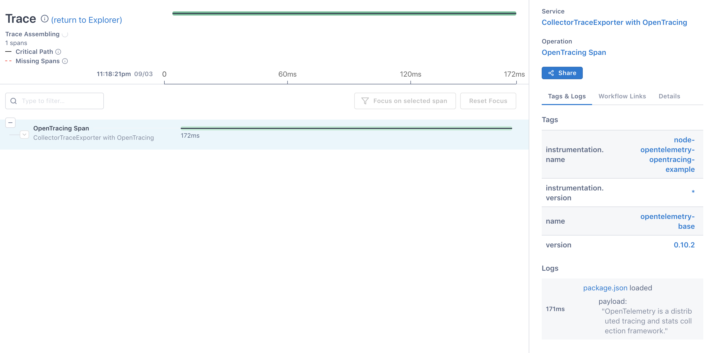

This example shows you how to use [OpenTelemetry](https://opentelemetry.io) [OpenTracing](https://opentracing.io/)

## Example

```javascript
const opentelemetry = require('@opentelemetry/api');
const { NodeTracerProvider } = require('@opentelemetry/node');
const { SimpleSpanProcessor, ConsoleSpanExporter } = require('@opentelemetry/tracing');
const { CollectorTraceExporter } = require('@opentelemetry/exporter-collector');
const tracerProvider = new NodeTracerProvider();
const axios = require('axios');

// TraceShim is needed to join OpenTelemetry with OpenTracing
const { TracerShim } = require('@opentelemetry/shim-opentracing');
const opentracing = require('opentracing');

tracerProvider.addSpanProcessor(new SimpleSpanProcessor(new ConsoleSpanExporter()));
tracerProvider.addSpanProcessor(new SimpleSpanProcessor(new CollectorTraceExporter({
  serviceName: 'CollectorTraceExporter with OpenTracing',
  url: 'https://ingest.lightstep.com:443/api/v2/otel/trace',
  headers: {
    'Lightstep-Access-Token': 'YOUR_TOKEN',
  },
})));

tracerProvider.register();
const otelTracer = opentelemetry.trace.getTracer('node-opentelemetry-opentracing-example');

// Init OpenTracing Global Tracer with OpenTelemetry Tracer
opentracing.initGlobalTracer(new TracerShim(otelTracer));
// Now get the Open Tracing global tracer
const tracer = opentracing.globalTracer();

// do a simple OpenTracing test
const span = tracer.startSpan('OpenTracing Span');
const headers = {};
tracer.inject(span, opentracing.FORMAT_HTTP_HEADERS, headers);
axios.get('https://raw.githubusercontent.com/open-telemetry/opentelemetry-js/master/package.json', headers).then(response => {
  span.logEvent('package.json loaded', response.data.description);
  span.setTag('name', response.data.name);
  span.setTag('version', response.data.version);
  span.finish();
}, console.log);

```
## Screenshots


