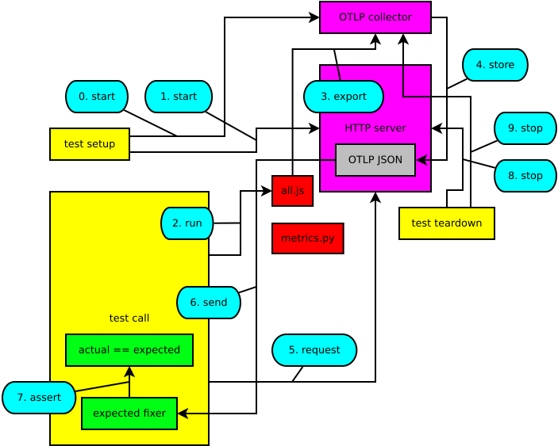

Metric Language Equivalent Tests
================================

This repo holds a testing framework that makes it possible to run OpenTelemetry
metric tests that compare the exported metrics generated by different
languages. The aim of this kind of testing is making sure that all the outputs
are the same for equivalent tests.

The Export Scripts
==================

To run this kind of testing in a particular language, three items are needed:

#. A directory named after a particular language
#. An export script in that directory that implements
   `The Script Specification`_
#. A defined command that can execute that script

The Script Specification
------------------------

The key words "MUST", "MUST NOT", "REQUIRED", "SHALL", "SHALL NOT", "SHOULD",
"SHOULD NOT", "RECOMMENDED", "MAY", and "OPTIONAL" in this section are to be
interpreted as described in `RFC 2119`_.

.. _RFC 2119: https://tools.ietf.org/html/rfc2119

This defines how the test script is to be implemented regardless of its
language.

#. It MUST implement a ``Meter`` with these attributes and respective values:

   - ``name``:``"name"``
   - ``version``:``"version"``

#. Metrics MUST be exported to ``127.0.0.1:7001``.
#. It MUST implement a ``Counter`` instrument with these attributes and respective values:

   - ``name``: ``"counter"``
   - ``description``: ``"description"``
   - ``unit``: ``"1"``
   - ``value_type``: ``int``

#. It MUST implement an ``UpDownCounter`` instrument with these attributes and respective values:

   - ``name``: ``"updowncounter"``
   - ``description``: ``"description"``
   - ``unit``: ``"1"``
   - ``value_type``: ``int``

#. It MUST implement a ``SumObserver`` instrument with these attributes and respective values:

   - ``name``: ``"sumobserver"``
   - ``description``: ``"description"``
   - ``unit``: ``"1"``
   - ``value_type``: ``int``
#. It MUST implement an ``UpDownSumObserver`` instrument with these attributes and respective values:

   - ``name``: ``"sumobserver"``
   - ``description``: ``"description"``
   - ``unit``: ``"1"``
   - ``value_type``: ``int``
#. It MUST implement a ``ValueObserver`` instrument with these attributes and respective values:

   - ``name``: ``"sumobserver"``
   - ``description``: ``"description"``
   - ``unit``: ``"1"``
   - ``value_type``: ``int``

There are 6  test values in an ordered sequence. These values MUST be
``[-1, 4, 3, 6, -5]`` in this order. There is one set of labels, which MUST be
``{"A": "B"}``.

Each instrument has a corresponding operation (for example ``add`` for a ``Counter``-typed instrument). Each operation of every instrument MUST be called only
once with one of the testing values and the set of labels.

Adding Tests
============

There is one test per language and these tests are written in Python, but it is
very straightforward to add tests for any language.

All are located in ``test_metrics.py`` and they follow this pattern:

.. code-block:: python

    def test_LANGUAGE():

        Popen(split("COMMAND"), cwd="DIRECTORY")

        sleep(5)

        actual = get("http://127.0.0.1:7002").json()

        assert fix_expected(actual) == actual

To add a new test, just change the values in caps in the pattern above for
their corresponding value. The existing tests can be used as a reference.

The Expected JSON Template
==========================

The output of the OTLP collector will be JSON that will be compared against the
JSON defined in `expected_template.json`. This file has a JSON structure that
will have some acceptable differences with the actual JSON output, timestamps,
for example. This differences will be "fixed" by the test case before making
any comparison between the actual and expected JSON OTLP output.

The Testing Framework
=====================

There are multiple components in this testing framework, they are shown in the
diagram_ below.

.. _diagram:

The execution of one of these tests can be summarized in 10 steps enumerated
in the diagram_:

0. The OTLP Docker collector is started
1. The HTTP Docker Server is started
2. The respective command for the test script is executed
3. The metrics are exported by the test script
4. The OTLP collector stores its JSON output in the HTTP server
5. The test requests the OTLP JSON output from the HTTP server
6. The HTTP server sends the OTLP JSON output to the test case who passes it to
   the JSON fixer. This fixer takes care of any acceptable difference between
   the actual and the expected OTLP JSON output.
7. The actual and expected JSON outputs are compared. If there is any
   non-acceptable difference between them, the test is reported as a failure.
8. The HTTP server is stopped.
9. The OTLP Docker collector is stopped.

How to run these tests
======================

Run ``tox``. This will start a Python virtual environment, install the testing
dependencies, and will call each test case one by one and will report the
results afterwards.

``tox`` will call ``pytest``_, the actual software that does the test setup,
execution, teardown and reporting. Options can be passed to ``pytest`` after a
double ``-``. Some useful options are:

Run only one test
-----------------

``tox -- -k test_java``

Produce verbose testing output
------------------------------

``tox -- -k test_python -vvvv``

Raise the debugger when a test case fails
-----------------------------------------

``tox -- -k test_nodejs --pdb``

Capture the console output
--------------------------

``tox -- -s``

This last option (``-s``) is needed if you want to debug a test. To do so edit
``test_metrics.py``:

1. Add ``from ipdb import set_trace`` at the first line of the file.
2. Add ``set_trace()`` where you want the execution to stop.

Use ``l`` to show surrounding code, ``n`` to go to next line, ``s`` to step into a
function and ``c`` to continue execution. More debugging commands can be found
here_.

.. _pytest: https://pytest.org
.. _here: https://docs.python.org/3/library/pdb.html
