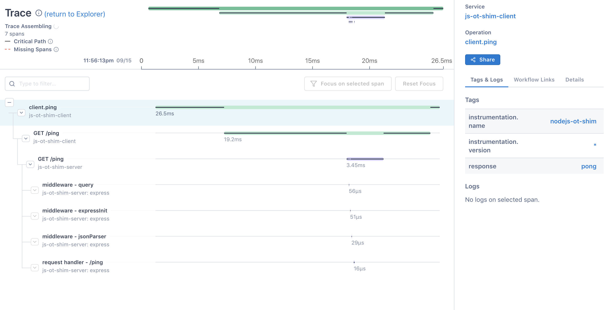

This example shows you how to use [OpenTelemetry](https://opentelemetry.io) with [OpenTracing](https://opentracing.io/)

```bash
export LS_ACCESS_TOKEN=<lightstep access token>
export LS_SERVICE_NAME=<service name>
```

## Start the client and server
```bash
docker-compose up
```

## Example

```javascript
const {
  lightstep,
  opentelemetry,
} = require('lightstep-opentelemetry-launcher-node');
const opentracing = require('opentracing');
const { TracerShim } = require('@opentelemetry/shim-opentracing');

const sdk = lightstep.configureOpenTelemetry({
  // if you don't use .env you can define params like this, otherwise those can be ommitted
  serviceName: 'js-ot-shim-client',
  accessToken: 'YOUR_TOKEN',
});

sdk.start().then(() => {
  const otelTracer = opentelemetry.trace.getTracer('nodejs-ot-shim');
  // Init OpenTracing Global Tracer with OpenTelemetry Tracer
  opentracing.initGlobalTracer(new TracerShim(otelTracer));
  // Now get the Open Tracing global tracer
  const tracer = opentracing.globalTracer();
  const span = tracer.startSpan('example span');
  span.setTag('test', 'foo');
  span.finish();
  // make optimistic flush without waiting for batch processor
  otelTracer.getActiveSpanProcessor().forceFlush();
});
```

## Screenshots
The following screenshot has been produced using the client and server example


